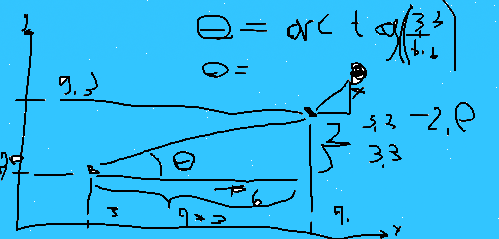

# Projeto Ora Bolas - Trabalho de Física:

## Objetivo:

-   Fazer o robo encontrar a bola
-   Plotar o gráfico da trajetória xy do robo e da bola até o ponto de interceptacao
-   Plotar o gráfico das coordenadas x e y em funcao do tempo até a interceptacao
-   Plotar gráfico dos componentes 𝑣𝑥 e 𝑣𝑦 da velocidade da bola e do robô em função do tempo 𝑡 até o instante de interceptação;
-   Plotar o gráfico dos componentes 𝑎𝑥 e 𝑎𝑦 da aceleração da bola e do robô em função do tempo 𝑡 até o instante de interceptação;
-   Plotar o gráfico da distância relativa 𝑑 entre o robô e a bola como função do tempo 𝑡 até o instante de interceptação;

## Detalhes da especificação do modelo do robo escolhido, no caso o <i>small-size</i>
 - Aceleração é igual a 2.8 m/s^2
 - Possui a massa de 2.8kg
 - Feito de alumínio
 - A bola usada tem que ter 20% da área do robo -> creio que é a área da base
 - Velocidade máxima do robo, segundo o pdf de projeto e desenvolvimento do mesmo robo da Universidade Federal do Rio Grande do Norte é de 0.92 m/s.
    - https://www.researchgate.net/publication/326430786_Projeto_e_Desenvolvimento_de_um_Time_de_Futebol_de_Robos_Moveis_de_Quatro_Rodas

## Observacoes:
   </img>
   ### Quando o robo está atrás da bola:
      - temos a velocidade máxima de 0.92 m/s, no entanto, essa velocidade nao serve para as componentes x e y, logo devemos descobrir vx e vy, mas como?
      - simples, pela fórmula da componente: Vx = V * cos(∆) e Vy = V * sen(∆)
      - como descobrimos o ∆?
      - ∆ seria igual ao arctg (dy / dx)
      - dy = ybola - yrobo e dx = xbola - xrobo
   ### Quando o robo está na frente da bola:
      - Tenho que pensar ainda...